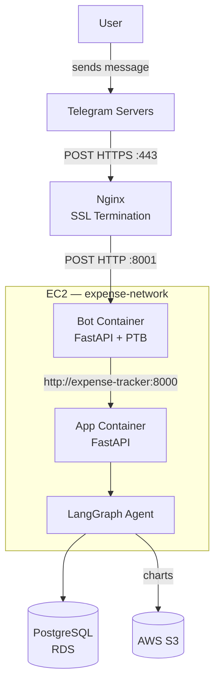
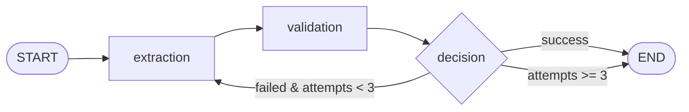
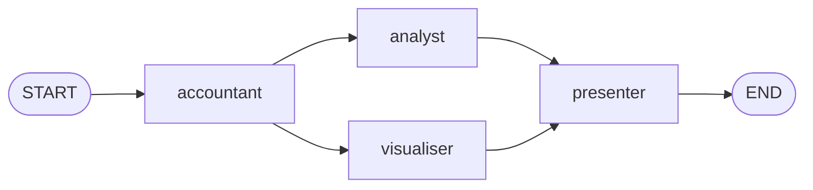

# 💸 Expense Tracker

An AI-powered expense tracker with a Telegram bot frontend. Log expenses in plain natural language — the agent automatically extracts the amount, category, date, and description. No forms, no dropdowns.

---

## Introduction

Most expense trackers make you fill in structured fields. I wanted to explore whether an LLM agent could handle that extraction reliably — and what it takes to make that production-ready.

This project is a full-stack application with a LangGraph-powered extraction pipeline, a Telegram bot frontend, budget alerting, financial report generation, full test coverage, and an automated CI/CD setup deploying to AWS EC2.

---

## Tech Stack

| Layer | Tech |
|---|---|
| Frontend | Telegram Bot (python-telegram-bot) |
| API | FastAPI |
| Agent | LangGraph + LangChain |
| LLM (dev) | Ollama (`llama3.2:3b`) |
| LLM (prod) | AWS Bedrock (`claude-3-5-sonnet`) |
| Database | SQLite (dev) / PostgreSQL on RDS (prod) |
| ORM | SQLAlchemy |
| Validation | Pydantic v2 |
| Testing | Pytest + pytest-mock |
| CI/CD | GitHub Actions → ECR → EC2 |
| Reverse Proxy | nginx (SSL termination) |
| Storage | AWS S3 (report charts) |
| Observability | LangFuse (LLM tracing) |

---

## Architecture



Both services run as separate Docker containers on a shared named network, deployed on a single EC2 instance.

---

## Agent Pipelines

### Expense Agent

Processes natural language expense input through a self-correcting state machine with a maximum of 3 attempts:



1. **Extraction** — LLM pulls out amount, category, date, description, and a confidence score
2. **Validation** — rejects null/invalid fields and inputs below the confidence threshold (default: 0.75)
3. **Decision** — on failure, injects the specific failure reason back into the retry prompt and loops; gives up after 3 attempts

### Report Agent

Generates monthly financial reports through a four-node pipeline. The analyst and visualiser nodes run in parallel after the accountant completes:



1. **Accountant** — queries RDS for spending data, computes category breakdowns and budget variances
2. **Analyst** — LLM generates personalised financial advice based on spending patterns
3. **Visualiser** — generates pie and bar charts with matplotlib
4. **Presenter** — assembles the final report and uploads charts to S3

---
## Observability

Agent runs are traced end-to-end via LangFuse. Every expense submission and report generation creates a trace showing:

- Per-node latency (extraction, validation, decision)
- LLM prompt and response for each inference call
- Token usage and estimated cost per request
- Retry attempts and failure reasons when extraction fails

Tracing is optional — if `LANGFUSE_PUBLIC_KEY` is not set, the app runs normally without it.

---

## Features

- **Natural language logging** — "Grabbed lunch at a hawker centre for $5.50" → extracts everything automatically
- **Telegram bot frontend** — log expenses, check history, generate reports, set budgets — all from chat
- **Budget alerts** — set a monthly budget globally or per category; get warnings at 80% and 100% spend
- **Financial reports** — AI-generated monthly summaries with spending insights, charts, and actionable recommendations
- **Flexible filtering** — query expenses by date range, category, or amount ceiling
- **Dual LLM backend** — Ollama locally, AWS Bedrock in production, swapped via a single env var

---

## Telegram Bot Commands

| Command | Description |
|---|---|
| (plain text) | Log an expense in natural language |
| `/start` | Register and get started |
| `/history` | View your last 10 expenses |
| `/report` | Generate your monthly financial report |
| `/setcategorybudget <category> <amount> <month>` | Set a category budget e.g. `/setcategorybudget Food 200 2026-05` |
| `/updatecategorybudget <category> <amount> <month>` | Update an existing category budget |
| `/setmonthlybudget <amount>` | Set your overall monthly budget e.g. `/setmonthlybudget 1000` |
| `/help` | Show all commands |

---

## Project Structure

```
├── app/
│   ├── agent/
│   │   ├── expense_agent/
│   │   │   ├── graph.py        # LangGraph state machine
│   │   │   ├── nodes.py        # Extraction, validation, decision nodes
│   │   │   ├── prompts.py      # LLM prompts
│   │   │   └── schemas.py      # Agent state + extracted expense schemas
│   │   │
│   │   └── report_agent/
│   │       ├── graph.py        # LangGraph state machine
│   │       ├── nodes/          # Accountant, analyst, visualiser, presenter
│   │       ├── prompts.py      # LLM prompts
│   │       └── schemas.py      # Report agent state schemas
│   │
│   ├── db/
│   │   └── database.py         # SQLAlchemy engine + session setup
│   │
│   ├── models/                 # SQLAlchemy ORM models (User, Expense, Budget)
│   ├── routers/                # FastAPI route handlers
│   ├── schemas/                # Pydantic request/response schemas
│   ├── main.py 
│   └── requirements.txt
│
├── bot/
│   ├── main.py                 # FastAPI + PTB webhook server
│   ├── handlers.py             # Command and message handlers
│   ├── user_service.py         # Telegram user registration + mapping
│   ├── config.py               # Bot settings
│   └── requirements.txt
│
├── Dockerfile_app              # App image
├── Dockerfile_bot              # Bot image
├── utils/
│   ├── config.py               # Pydantic settings + env config
│   ├── db_helpers.py           # Dialect-aware SQL helpers
│   └── logger.py
│
└── tests/
    ├── unit/                   # Node-level unit tests
    ├── agent/                  # End-to-end graph traversal tests
    └── integration/            # Full HTTP request/response tests
```

---

## API Endpoints

### Users
| Method | Endpoint | Description |
|---|---|---|
| `GET` | `/users/{user_id}` | Get user by ID |
| `POST` | `/users/` | Create user |
| `PUT` | `/users/{user_id}` | Update user details |

### Expenses
| Method | Endpoint | Description |
|---|---|---|
| `GET` | `/expenses/` | Get expenses with optional filters |
| `GET` | `/expenses/{expense_id}` | Get expense by ID |
| `POST` | `/expenses/` | Create expense (runs agent pipeline) |
| `PUT` | `/expenses/{expense_id}` | Update expense manually |
| `DELETE` | `/expenses/{expense_id}` | Delete expense |

### Budgets
| Method | Endpoint | Description |
|---|---|---|
| `GET` | `/budgets/{user_id}` | Get all budgets for a user |
| `POST` | `/budgets/` | Create category budget |
| `PUT` | `/budgets/{user_id}` | Update category budget |

### Reports
| Method | Endpoint | Description |
|---|---|---|
| `POST` | `/report/` | Generate monthly financial report |

---

## Testing

Tests are structured across three layers, with the LLM mocked out for deterministic results:

```bash
pytest
```

- `tests/unit/` — individual node logic (extraction, validation, decision routing)
- `tests/agent/` — full LangGraph graph traversal with mocked LLM responses
- `tests/integration/` — full HTTP request/response cycle per endpoint, including error paths

---

## CI/CD

Automated via two GitHub Actions workflows:

**CI** — runs on every push to `dev` and `main`, executes the full test suite

**CD** — triggers automatically after CI passes on `main`; builds both Docker images (API + bot), pushes to Amazon ECR, SSHs into EC2, and restarts both containers. Cleans up old images after each deploy to prevent disk space issues.

Deployments only happen when all tests pass.

---

## Infrastructure

- **EC2** — single instance running both containers on a shared Docker named network
- **RDS** — PostgreSQL database, not publicly accessible, only reachable from EC2
- **ECR** — private Docker image registry for both app and bot images
- **S3** — stores generated report charts (pie and bar) per user per month
- **nginx** — reverse proxy handling SSL termination for the Telegram webhook
